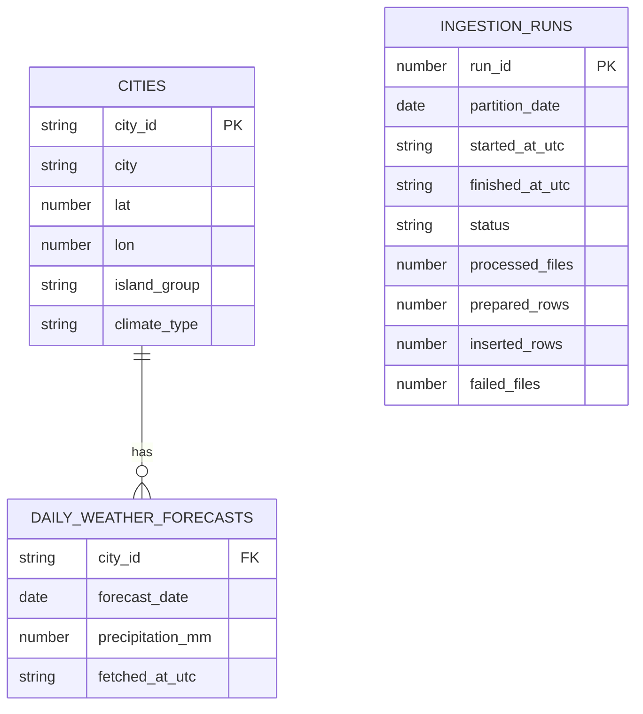

# PH Rainfall Pipeline ERD

```mermaid
erDiagram
    CITIES ||--o{ DAILY_WEATHER_FORECASTS : has

    CITIES {
        string city_id PK
        string city
        number lat
        number lon
        string island_group
        string climate_type
    }

    DAILY_WEATHER_FORECASTS {
        string city_id FK
        date forecast_date
        number precipitation_mm
        string fetched_at_utc
    }

    INGESTION_RUNS {
        number run_id PK
        date partition_date
        string started_at_utc
        string finished_at_utc
        string status
        number processed_files
        number prepared_rows
        number inserted_rows
        number failed_files
    }
```